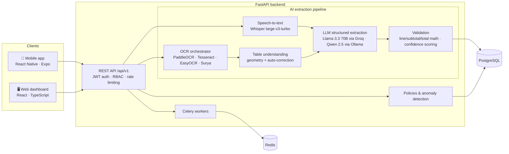

# ExpenseVoice AI

**Voice- and photo-first expense management for agricultural businesses.**
Field employees record a purchase by speaking or by photographing the invoice; an AI pipeline turns it into a structured, validated record that managers review, track and audit from a web dashboard.

Built for **Abes AgroTech** (Tunisia) — a full-stack production system: FastAPI backend, React dashboard, React Native mobile app, and a multi-stage OCR + LLM extraction pipeline.


---

## The problem

Farm workers buy supplies all day — fertiliser, fuel, spare parts — and paper invoices pile up. Typing each one into a system is slow, error-prone and often skipped, so managers lose visibility on spending until the end of the month.

## The solution

| Input | What happens |
|---|---|
| 🎙️ **Voice** — "I bought 20 bags of fertiliser at 45 dinars from Supplier X" | Speech-to-text (Whisper) → LLM extracts supplier, items, quantities, prices → draft purchase |
| 📷 **Invoice photo** | Image preprocessing → multi-engine OCR → table understanding → LLM extraction → math validation → draft invoice |
| ✅ **Review** | Confidence score per field; low-confidence extractions are flagged for manual review instead of being trusted blindly |
| 🚨 **Control** | Spending policies and anomaly detection (daily spikes, abnormal unit prices, category shifts) raise alerts for the director |

## Architecture



### How the invoice pipeline stays reliable

LLMs and OCR both make mistakes on real-world, crumpled, multilingual invoices. The pipeline is built so that errors are **caught, not hidden**:

1. **Multiple OCR engines with fallback** — the orchestrator tries providers in order with retries (`OCR_PROVIDER=paddleocr,tesseract,…`).
2. **Text normalisation** before the LLM, so the model sees clean, consistent input.
3. **LLM draft + heuristic fallback** — if the LLM output is incomplete, rule-based extractors fill the gaps.
4. **Arithmetic validation** — quantity × unit price = line total, lines sum to subtotal, subtotal + tax = total.
5. **Confidence-based review** — each extraction gets a `high / medium / low` status; low confidence means *no line items are trusted* and the invoice goes to manual review.

## Features

- **Voice purchase entry** (Arabic, French, English) with cloud (Groq) or local (faster-whisper) transcription
- **Invoice scanning** with automatic supplier recognition and line-item table extraction
- **Role-based access** — director and employee roles with dedicated web and mobile experiences
- **Spending policies & alerts** — configurable rules, anomaly detection, alert export (CSV / PDF)
- **Audit log** of every action, exportable as PDF
- **Statistics dashboard** with charts and PDF reports
- **Multilingual UI** — Arabic (RTL), French, English
- **Production deployment** — Docker Compose, Nginx reverse proxy, HTTPS, Celery + Redis background jobs

## Tech stack

| Layer | Technologies |
|---|---|
| Backend | Python, FastAPI, SQLAlchemy 2, PostgreSQL, Celery, Redis, JWT, SlowAPI |
| AI / ML | Whisper (Groq API & faster-whisper), Llama 3.3 70B (Groq), Qwen 2.5 & LLaVA (Ollama), PaddleOCR, Tesseract, EasyOCR, Surya, OpenCV |
| Web | React 18, TypeScript, Vite, Tailwind CSS, TanStack Query, Recharts, i18next |
| Mobile | React Native, Expo, Expo Router, expo-audio, expo-camera |
| DevOps | Docker, Docker Compose, Nginx, Certbot, pytest |

## Project structure

```
backend/
  app/
    api/            REST endpoints (auth, purchases, voice, invoices, alerts, audit, stats…)
    services/
      speech/       Whisper transcription + voice parsing
      ocr/          OCR providers and orchestrator
      table_understanding/  invoice table inference & auto-correction
      validation/   math validation and review decision
      llm/          LLM clients
    models/         SQLAlchemy models
    workers/        Celery tasks
  tests/            unit + integration tests
dashboard/          React web app (director & employee)
mobile/             React Native (Expo) app
nginx/              reverse proxy config
docs/DEPLOYMENT.md  production deployment guide
```

## Getting started (development)

**Prerequisites:** Docker & Docker Compose, Python 3.12, Node.js 20+

```bash
# 1. Database (or run the full stack: docker compose -f docker-compose.dev.yml up)
docker compose -f docker-compose.dev.yml up -d db

# 2. Backend
cd backend
python -m venv .venv && source .venv/bin/activate
pip install -r requirements.txt
cp .env.example .env        # set GROQ_API_KEY, DATABASE_URL, JWT_SECRET
uvicorn app.main:app --reload
# API docs → http://localhost:8000/docs

# 3. Web dashboard
cd ../dashboard && npm install && npm run dev

# 4. Mobile app
cd ../mobile && npm install && npx expo start
```

Run the tests:

```bash
cd backend && pytest
```

For production (Docker Compose, Nginx, HTTPS), see **[docs/DEPLOYMENT.md](docs/DEPLOYMENT.md)**.

## Author

**Mouataz Bouazizi** — AI Engineer · [LinkedIn](https://www.linkedin.com/in/moataz-bouazizi-409068245/)
